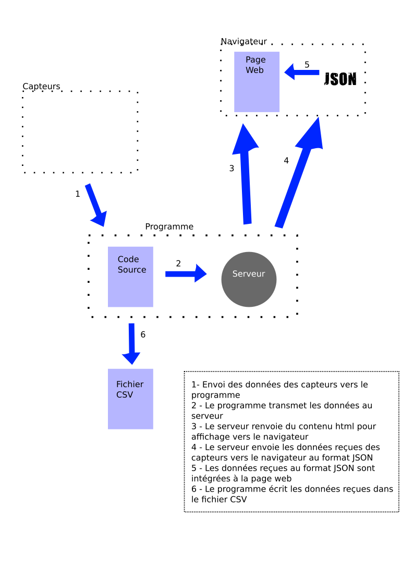

Ce projet est une implémentation de l'observation des valeurs telles que la température, l'humidité et la pression atmosphérique. Il utilise un serveur Flask pour renvoyer les valeurs mesurer vers le navigateur tout en les enregistrant sous format CSV.

## Composants

Le circuit d'obtention des données est constitué d'une Raspberry Pi 4B, d'un capteur DHT22 pour mesurer la température et l'humidité et d'un capteur bme280 pour la mesure de la pression atmosphérique. Le flux d'échange des données est expliqué à la figure suivante.

